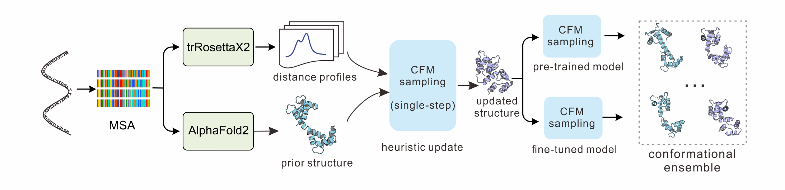

<h1 align="center">trFlow: ultrafast all-atom protein conformational ensemble generation via conditional flow matching</h1>

<p align="center">
  <a href="https://www.python.org/"></a>
  <a href="https://pytorch.org/"></a>
  <a href="LICENSE"></a>
</p>

<p align="center">
  
</p>

## Overview

trFlow generates alternative protein conformations from an A3M
multiple-sequence alignment (MSA). The first A3M record supplies the target
sequence; an optional FASTA file can be provided for strict cross-validation.
trFlow can obtain an initial structure with the bundled OpenFold inference code
or start from a user-provided PDB.

The prediction pipeline contains three stages:

1. **Initialization and representation** — OpenFold predicts the initial
   structure, while the selected Xray and/or NMR network processes the MSA.
2. **Geometric exploration** — the predicted geometry is iteratively combined
   with structural distances to obtain updated starting conformations.
3. **Flow sampling** — FlowFormer combines structural, pair, and MSA
   representations before the structure module generates the final ensemble.

Geometric exploration can be disabled when only the initial-structure sampling
paths are required.

## Installation

### Requirements and platform scope

The supported Python version is **3.11**. Use a repository checkout and an
editable installation for the complete prediction workflow: model checkpoints,
OpenFold resources, examples, and local environment configuration are separate
from the Python package.

| Workload | Runtime requirements | Platform notes |
| --- | --- | --- |
| Local Web UI and ensemble analysis | Python 3.11, NumPy, SciPy, and a modern browser | Native Windows and Linux; no model weights or CUDA needed to inspect existing PDB ensembles |
| New ensemble prediction | Compatible NVIDIA GPU/driver, CUDA-enabled PyTorch, model checkpoints, and the OpenFold initialization dependencies | The supplied prediction environment is Linux-oriented; use the Linux stack inside WSL2 on Windows or a separately validated native environment |
| TM-score evaluation | A compatible TMscore executable, in addition to the Python dependencies | The bundled binary is Linux x86-64; provide another executable with `--tmscore` on Windows or other architectures |

CPU/Web checks and GPU prediction are different validation targets. A working
browser interface, successful CPU tests, or CUDA-capable PyTorch alone does not
establish that the full OpenFold/model pipeline is ready. End-to-end GPU
prediction must be checked separately in the intended execution environment;
the Web/CPU support described here does not imply a verified Linux GPU run.

### Clone the repository

```bash
git clone https://github.com/YangLab-SDU/trFlow.git
cd trFlow
```

### Option A: local Web UI and CPU analysis

This lightweight setup is useful for exploring existing predictions and for
developing the Web interface. It intentionally does not install the GPU
prediction stack. The commands below use the virtual environment's interpreter
directly, so shell activation is not required.

Windows PowerShell:

```powershell
py -3.11 -m venv .venv-web
& .\.venv-web\Scripts\python.exe -m pip install --upgrade pip
& .\.venv-web\Scripts\python.exe -m pip install -r requirements-web.txt
& .\.venv-web\Scripts\python.exe -m pip install -e . --no-deps
& .\.venv-web\Scripts\python.exe .\run_web.py --data-dir .\outputs\web-preview --no-browser
```

Linux Bash:

```bash
python3.11 -m venv .venv-web
.venv-web/bin/python -m pip install --upgrade pip
.venv-web/bin/python -m pip install -r requirements-web.txt
.venv-web/bin/python -m pip install -e . --no-deps
.venv-web/bin/python run_web.py --data-dir outputs/web-preview --no-browser
```

Open [http://127.0.0.1:8765](http://127.0.0.1:8765) in your browser. Existing
results under `outputs/*/predictions/` can be imported automatically when their
`info.json` is present. If no results are available, the workbench starts with
an empty target list; viewing the submission form does not run inference.

`--no-deps` is intentional here: `requirements-web.txt` supplies the analysis
dependencies without downloading the full PyTorch/OpenFold stack. Do not submit
new predictions from this CPU-only environment. Use Option B, or select a
separately configured prediction interpreter as described below. The dedicated
`web-preview` directory keeps this session separate from another workbench's
persistent queue.

If the Windows Python launcher is unavailable, replace `py -3.11` with the
path to a Python 3.11 interpreter. The project does not require a change to the
PowerShell execution policy.

### Option B: GPU prediction environment

The supplied `environment.yml` and `requirements.txt` use Python 3.11 and
PyTorch 2.6.0 with CUDA 11.8. Install a compatible NVIDIA driver and the required
model dependencies before submitting predictions. For Windows GPU use, run
these Linux instructions inside a configured
[WSL2 Linux environment](https://learn.microsoft.com/en-us/windows/wsl/install);
the native Windows Web setup above does not install that environment.

Use [Mamba](https://mamba.readthedocs.io/en/latest/installation/mamba-installation.html)
or [Conda](https://www.anaconda.com/docs/getting-started/miniconda/install) to
create the prediction environment. From the repository root in Linux Bash:

```bash
mamba env create -f environment.yml
conda activate trflow
python -m pip install -e . --no-deps
cp -n config/env_config.json.template config/env_config.json
```

`conda env create -f environment.yml` can be used instead of Mamba. For a
pip-only installation, create a Python 3.11 environment, install
`requirements.txt`, and then install the project with
`python -m pip install -e . --no-deps`. The dependency files describe the Linux
prediction stack; native Windows inference dependencies must be validated
separately rather than assumed to be installed by the lightweight Web setup.

Download the pretrained model weights separately and extract the four files
directly into `models/`:

```bash
mkdir -p models
wget http://yanglab.qd.sdu.edu.cn/trFlow/pretrained_models.tar.bz2
tar -xjf pretrained_models.tar.bz2 -C models
```

The archive contains:

| File | Description |
| --- | --- |
| `trflow_xray.pth` | trFlow Xray checkpoint |
| `trflow_nmr.pth` | trFlow NMR checkpoint |
| `esm_msa1_t12_100M_UR50S.pt` | ESM-MSA-1b weights |
| `openfold_params_model_5_ptm.npz` | OpenFold `model_5_ptm` parameters |

The default configuration expects these files in `models/`.

Edit the local `config/env_config.json` to set model paths, GPU indices, and an
OpenFold interpreter if initialization uses a separate environment. Relative
environment paths resolve against the repository root. Keep this
machine-specific file out of version control; the committed template documents
the expected fields.

Before inference, check the selected prediction interpreter:

```bash
python -c "import torch; print(torch.__version__); print('CUDA available:', torch.cuda.is_available())"
```

PyTorch documents the supported CPU and CUDA builds in its
[previous-version installation instructions](https://pytorch.org/get-started/previous-versions/).
The check above does not load checkpoints or validate OpenFold initialization.
Supplying an initial PDB skips OpenFold initialization, but the remaining
trFlow/ESM models and their prediction dependencies are still required.

## Usage

The command-line interface follows the form:

```text
trFlow predict INPUT [OPTIONS]
```

`INPUT` may be a JSON run configuration or an A3M file. A FASTA file can also
be used together with `--msa`; direct A3M input is recommended.

### Predict from JSON

Run the standard single-target example (`8CRJ_8CRI`) or the two-target
batch example (`8CRJ_8CRI` and `2akl`). Both configurations run the
complete pipeline and generate 10 conformations per target:

```bash
trFlow predict example/example_input.json
trFlow predict example/example_batch_input.json
```

### Predict directly from A3M

```bash
trFlow predict example/msa/2akl.a3m \
  --output-dir outputs \
  --models Xray,NMR --sample-num 10
```

The first A3M record must be the ungapped target sequence. To cross-check it
against a separate FASTA file:

```bash
trFlow predict example/msa/8CRJ_8CRI.a3m \
  --fasta example/fasta/8CRJ_8CRI.fasta --output-dir outputs
```

To start from an existing structure instead of running OpenFold:

```bash
trFlow predict alignment.a3m --init-pdb initial.pdb --output-dir outputs
```

To provide the target sequence explicitly, use a FASTA file together with its
A3M alignment:

```bash
trFlow predict sequence.fasta --msa alignment.a3m --output-dir outputs
```

Run `trFlow predict --help` for all available options.
By default, trFlow generates 200 conformations per target; use `--sample-num`
to select a different ensemble size.

### Common options

| Option | Description |
| --- | --- |
| `--fasta FILE` | Optional FASTA used to validate the first A3M record |
| `--msa FILE` | A3M alignment when a FASTA file is used as `INPUT` |
| `--name NAME` | Set the target name for direct A3M/FASTA input |
| `--init-pdb FILE` | Use an existing initial structure |
| `--env FILE` | Use a custom environment configuration |
| `--output-dir DIR` | Set the output directory |
| `--sample-num N` | Number of conformations to generate (default: 200) |
| `--models Xray,NMR` | Select one or both trained models |
| `--single-step` | Use one structure-model forward per sample |
| `--steps N` | Set the number of structure-model forwards |
| `--no-random-step` | Use `--steps` instead of randomly choosing 1 or 7 forwards |
| `--no-random-step-size` | Use evenly spaced flow times |
| `--no-geometric-exploration` | Disable geometric exploration |
| `--parallel` | Enable intra-sample multi-GPU parallelism |
| `--save-repr-npz` | Save intermediate representations |
| `--seed N` | Set an optional reproducibility seed |

`--steps` counts actual structure-model forwards, with a default of 7.
`--single-step` overrides this to one forward. When random step selection is
enabled, each sample uses either 1 or 7 forwards; disable it to use `--steps`.

No seed is fixed by default. Specify `--seed` or a JSON `seed` value only when
a reproducible run is required. The effective run seed is recorded in
`info.json`.

## JSON input

```json
{
  "output_dir": "outputs",
  "samples": [
    {
      "name": "8CRJ_8CRI",
      "msa_path": "example/msa/8CRJ_8CRI.a3m",
      "init_pdb": null
    }
  ],
  "options": {
    "sample_num": 10,
    "geometric_exploration": true,
    "single_step": false,
    "steps": 7,
    "random_step": true,
    "random_step_size": true,
    "models": ["Xray", "NMR"],
    "parallel": false,
    "save_repr_npz": false
  }
}
```

Multiple entries in `samples` are processed as a batch. Command-line options
take precedence over the corresponding JSON values.

The optional `fasta_path` field enables strict sequence cross-validation.
When it is omitted, the target sequence is read from the first A3M record.
FASTA/A3M sequence mismatches are rejected.

## Output

Each target is written to `{output_dir}/{sample_name}/`:

```text
{output_dir}/{sample_name}/
|-- input.json
|-- info.json
|-- {sample_name}_init.pdb
|-- {sample_name}_updated_Xray.pdb
|-- {sample_name}_updated_NMR.pdb
|-- {sample_name}_reprs.npz
|-- openfold_log.txt
`-- predictions/
    `-- {sample_name}_sample_001.pdb ...
```

Existing results, when available, can be inspected in `outputs/`; running the
example configurations generates new results. Files that do not apply to the
selected options are omitted.
`input.json` stores the resolved run configuration, while `info.json` records
stage timing, initialization source, generated structures, model paths, and
mean pLDDT values.

## Local web interface

### Start the workbench

Start the local workbench from the installed trFlow environment:

```bash
trFlow web
```

Open `http://127.0.0.1:8765`. The source-tree entry points are also available:

```bash
python -m trflow web
python run_web.py
```

These entry points accept the same options in Windows PowerShell and Linux
Bash. Pass `--no-browser` to open the page manually.

The default prediction interpreter is the Python interpreter running the
server. `--python` can select another configured interpreter for prediction;
CPU alignment and clustering use the server's own NumPy/SciPy environment.
The selected prediction interpreter must be able to import this checkout and
load its configured model assets. When using WSL2 for GPU inference, run the
server and prediction environment inside WSL2 rather than passing a Linux
executable path to a native Windows process.

The interface opens in English. Use the language selector in the header to
switch between English and Chinese; the preference is retained across the
workbench, target details, and subsequent visits.
Application errors are localized too, including previously saved interrupted
runs. Original model diagnostics are clearly marked and remain unchanged,
along with logs and user-provided content, for troubleshooting. Changing the
language preserves unsubmitted form values, uploaded files, and the viewer's
current display state.

### Submit targets and select a generation mode

Upload or paste an A3M alignment, choose the number of conformations, and submit
one or more targets. The first A3M record supplies the target sequence. Advanced
settings are collapsed by default and use the same defaults as the prediction
CLI: 200 conformations, Xray and NMR models, geometric exploration enabled, and
no fixed seed. An optional FASTA or initial PDB can be uploaded.
The advanced generation mode is a mutually exclusive choice:

| Mode | Generation steps | Fixed-count input |
| --- | --- | --- |
| Single-step generation | 1 | Disabled |
| Random generation steps | 1 or 7 per conformation; the default mode | Disabled |
| Fixed generation steps | User-selected integer from 1 to 100; default value 7 | Editable |

These counts represent actual structure-model forwards, not the number of
output conformations. Switching modes retains the previous fixed count.
Random step size controls the flow-time spacing independently of the selected
generation mode.

The **Load example** button fills the submission form with `2akl` from
`example/msa/2akl.a3m`; review the settings before adding it to the run queue.

The **Import JSON** dialog accepts the existing trFlow `samples`/`options` format.
Relative input paths refer to the repository root. When an input file is not
already in the repository, upload the corresponding A3M/FASTA/PDB alongside
the JSON; filenames are matched against its input paths. Inline `msa_text`,
`fasta_text`, and `init_pdb_text` fields are supported as well. Web outputs are
always stored in the workbench data directory.

### Queue and local storage

Targets run one at a time in submission order. Open a target to inspect its
pipeline stage, generated-structure count, and live log. Closing or refreshing
the browser does not stop the server or its queue. Stop the server with
`Ctrl+C` when the session is finished.

Queue records persist across service restarts. Queued targets remain queued;
an interrupted target with a complete prediction set resumes structural
analysis without repeating inference. An incomplete interrupted run is marked
as failed and can be retried explicitly.

In a source checkout, the default data directory is `outputs/web/`. Set
`--data-dir` to use another directory. When running an installed package outside
a checkout, the default is `outputs/web/` under the current working directory.
The workbench stores its state locally:

```text
outputs/web/
|-- targets.sqlite              # persistent queue and target records
|-- service.lock                # prevents two servers using the same data directory
|-- jobs/
|   `-- <target-id>/             # inputs, request JSON, predictions, logs and analysis
`-- recycle_bin/                # recoverable deleted targets and restoration metadata
```

Stop the service before backing up the data directory so that its SQLite state
and per-target files are copied consistently. Input sequences, local paths,
logs, and results may be sensitive; keep them out of public source control.
Web submissions are limited to 50 targets per batch, 2,000 conformations per
target, and 64 MiB per JSON request. Split larger uploads into smaller batches.

### Delete and restore targets

Targets can be removed from the list or their detail page after confirmation.
For an active target, the confirmation requires **Cancel and delete**, which
stops that target before removal. Removal moves workbench inputs and
results to the local `recycle_bin` inside the data directory, rather than
permanently erasing them. Existing result files outside the workbench are left
untouched, and removed targets stay hidden after a service restart. The deletion
notification offers **Undo** to restore a target; restoring a cancelled target
does not automatically restart its prediction. The notification is temporary,
but its expiry does not purge the saved recycle-bin data. The local API also
provides `GET /api/recycle-bin` and
`POST /api/recycle-bin/{target-id}/restore` with an empty JSON object for
recovery after the notification has closed.

### Explore and export completed ensembles

Completed targets provide:

- An interactive 3Dmol.js viewer of all rigidly aligned conformations.
- Cluster representatives, single-structure selection, and ordered playback.
- An adjustable cluster count (default 10, capped by ensemble size).
- Interactive cluster populations, a PCA projection, and a pairwise RMSD map.
- A `trflow_{target_name}.zip` download of aligned PDBs, the selected clustering and run metadata.

The download uses the cluster count currently selected in the detail view.
While a changed count is being analyzed, downloading is disabled until the
matching clustering is ready:

```text
trflow_{target_name}.zip
|-- prediction/                 # all PDBs, already aligned to one reference
|-- clusters/
|   |-- representatives/        # one aligned medoid PDB per cluster
|   |-- assignments.csv         # per-structure membership, RMSD and confidence
|   |-- summary.csv             # cluster sizes, representatives and RMSD statistics
|   `-- clusters.json           # full clustering, distances, PCA and methods
|-- info.json                   # original prediction metadata
|-- input.json                  # resolved prediction input, when available
|-- README.txt                  # coordinate, index and field conventions
`-- run.log                     # included when available
```

No separate `align/` or `aligned/` directory is needed. Representative PDBs use
the same reference frame as `prediction/`. JSON structure indices are zero-based
and cluster IDs are one-based; all file references in the clustering metadata
resolve inside the archive. Server-side original prediction files are preserved.
The filename uses the visible target name, not the internal queue ID; `2akl`
downloads as `trflow_2akl.zip`. Unsafe filename characters are replaced with underscores.

Run metadata and logs are included where available. Review an archive for
private sequences, paths, and diagnostic information before sharing it.

Alignment uses corresponding C-alpha atoms and the Kabsch algorithm. Clustering
uses average linkage on pairwise best-fit C-alpha RMSD; each representative is a
medoid from the generated ensemble. The PCA projection shows variation in
aligned coordinates. These clusters describe geometric similarity and are not
estimates of equilibrium populations or free energies.

Existing prediction ensembles under `outputs/*/predictions/`, accompanied by
their `info.json`, can be imported without re-running inference. Their source
PDB files are preserved.

### Startup options and security boundary

Optional startup settings:

```bash
trFlow web --port 8765 --data-dir outputs/web --no-browser
trFlow web --env config/env_config.json --python /path/to/trflow/python
```

The server binds to `127.0.0.1` and validates request hosts and origins. It is a
local, single-user workbench, not a public inference service: it has no
multi-user authentication or TLS. Do not expose it through a reverse proxy,
public port forwarding, or an externally listening address without an
independent security design. Loopback binding does not replace ordinary
protection of the local machine and its files.

The frontend and 3D viewer assets are bundled. Viewing and analyzing local
ensembles does not require an external CDN or uploading structures to a cloud
service; initial dependency and model downloads still require network access.
Node.js, npm, and a frontend build step are not required to run the workbench.
Node.js and Playwright are used only for development browser tests.

Additional options are documented by `trFlow web --help`. Use
`--no-import-existing` when a session should not import results from the
repository's `outputs/` directory.

## Evaluation

`trFlow evaluate` compares predicted structures with one or more reference PDB
files and writes RMSD and TM-score results to CSV:

```bash
trFlow evaluate --pred-dir outputs/8CRJ_8CRI/predictions --native-dir path/to/references --output outputs/evaluation.csv
```

TM-score calculations always use sequence alignment (`-seq`). By default the
command uses the bundled Linux x86-64 executable at `bin/TMscore`. Use
`--tmscore /path/to/TMscore` to select another executable, for example on a
different platform.

On native Windows, use a Windows-compatible executable, for example:

```powershell
trFlow evaluate --pred-dir outputs/8CRJ_8CRI/predictions --native-dir path/to/references --tmscore "C:\tools\TMscore.exe" --output outputs/evaluation.csv
```

The repository does not supply a Windows TMscore binary.

## Development and validation

The Web/analysis subset can run in the lightweight CPU environment:

```bash
python -m unittest discover -s tests -p "test_web*.py" -v
```

For the full CPU regression suite, install a CPU PyTorch build and the test
dependencies in a Python 3.11 environment:

```bash
python -m pip install torch==2.6.0 --index-url https://download.pytorch.org/whl/cpu
python -m pip install -r requirements-test.txt
python -m pip install -e . --no-deps
python -m unittest discover -s tests -v
```

The commands also work in PowerShell with a configured `python` interpreter.
See [tests/README.md](tests/README.md) for the dependency setup and browser
checks. Browser tests use synthetic fixtures or mocked APIs; they must not
submit GPU jobs or delete real workbench data.

The [CPU and local Web CI workflow](.github/workflows/cpu-web.yml) is configured
for Python 3.11 on Windows and Linux. Check the actual GitHub Actions run before
claiming a passing result for either platform; a configured job is not itself
evidence that it has passed.

The CPU suite covers input validation, sampling-step semantics with stub
models, queue persistence, API boundaries, recoverable deletion, alignment,
clustering, exports, and localized errors. These checks do not download model
weights, run full OpenFold initialization, or perform end-to-end CUDA
prediction. Passing Windows/Linux CPU checks is not a GPU performance or
scientific-accuracy certification.

To validate actual prediction in a fully configured GPU environment, run the
example JSON configurations documented above and inspect their output and
logs. Keep private machine configuration, generated workbench databases,
browser screenshots, test artifacts, and newly generated user results out of
public commits.

## Acknowledgements

This repository vendors portions of OpenFold and ESM used by the inference
pipeline. Their original copyright and license notices are retained in the
corresponding source files. The local web interface bundles 3Dmol.js 2.5.5 under
the BSD 3-Clause license; its license and included third-party notices are
retained in `trflow/web_static/vendor/`.
Model weights are distributed separately.
